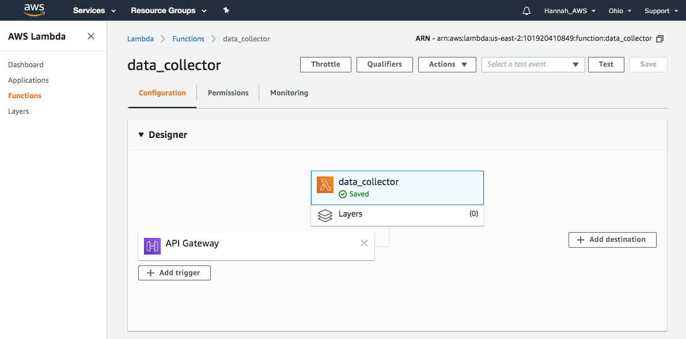
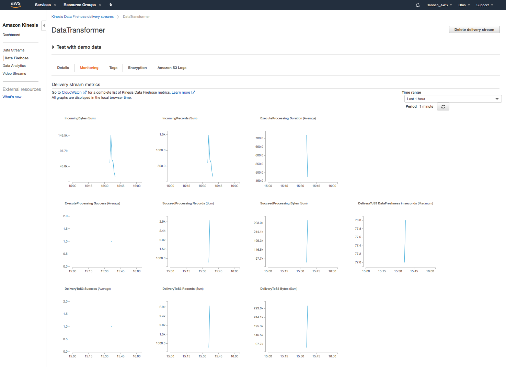

# StreamingFinanceData
Real-time stock data analysis for STA9760 Project III

I created an application to analyze streaming data. The data is intraday stock prices for 10 companies in 1-minute periods. I created AWS Lambda functions for downloading and processing the data from Yahoo Finance (using yfinance python module), then storing in an AWS S3 bucket. Data collection is triggered from this url: [https://6tohwow1zg.execute-api.us-east-2.amazonaws.com/default/data_collector
](https://6tohwow1zg.execute-api.us-east-2.amazonaws.com/default/data_collector).
I used AWS Athena to support querying the data from the S3 bucket. As an application I found the high price for each company in each hour. This technology stack can be used to query streaming data in near real time. 

### DataCollector Lambda configuration page

### Kinesis Data Firehose Delivery Stream Monitoring
